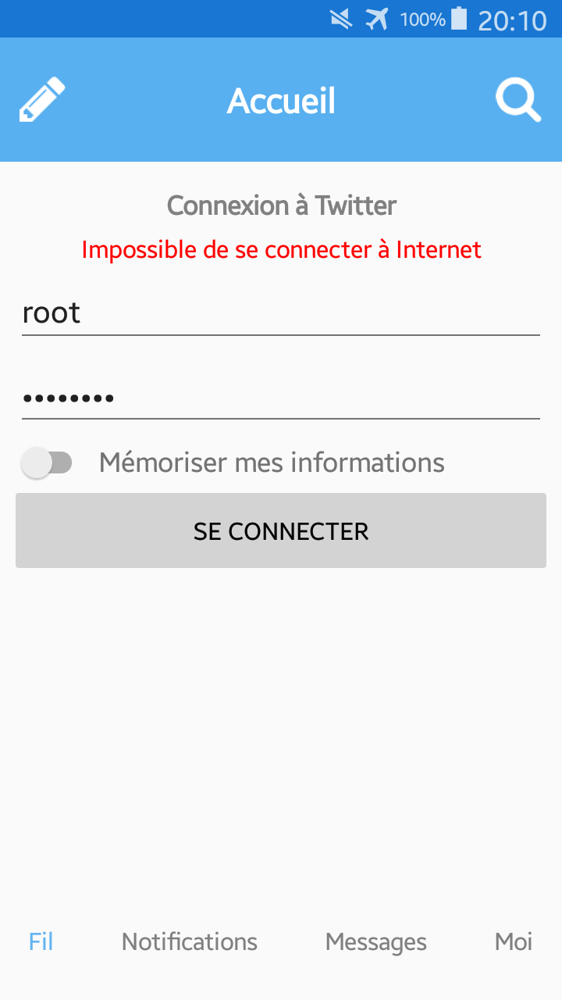

## Xamarin

Le développement cross plateform avec Xamarin 

- [x] **Module 1** 
- [x] **Module 2**
- [x] **Module 3** 
- [x] **Module 4** > TP_xamarin(partie1)
- [x] **Module 5** > TP_xamarin2(partie2) 
- [x] **Module 6** > TP_xamarin3(partie3)
- [x] **Module 7** > TP_xamarin4(partie4)
- [x] **Module 8** > TP_xamarin4(partie5)
- [x] **Module 9** > TP_music + TP_xamarin9

  -  -  - 

